```{r}
#| label: setup
#| include: false
knitr::opts_chunk$set(
  fig.align = "center",
  fig.width = 7,
  fig.height = 5
)
library(terra)
library(data.table)
```

# Executive Summary

This report presents a comprehensive analysis of climate projections for the Czech Republic, focusing on temperature and precipitation changes under different emission scenarios. Using the GFDL-ESM4 climate model from CMIP6, we analyzed historical climate data (1850–2014) and future projections (2015–2100) under three Shared Socioeconomic Pathways: SSP1-2.6 (low emissions), SSP3-7.0 (medium-high emissions), and SSP5-8.5 (high emissions).

Key findings include: (1) temperature in Czechia is projected to increase by 1.2–3.7°C by end of century depending on scenario; (2) precipitation shows spatial heterogeneity with increases in northern regions and decreases in southern areas; (3) warming thresholds of 1.5°C and 2.0°C are reached around 2055 and 2065 respectively under SSP5-8.5; and (4) downscaling from 55 km to 14 km resolution reveals important local-scale variations. The analysis was performed using cloud computing infrastructure on Metacentrum with containerized workflows.

# Introduction

## Background

Climate change represents one of the most significant challenges facing Central Europe. The Czech Republic, located in the heart of Europe, is particularly vulnerable to changing temperature and precipitation patterns that affect agriculture, water resources, and ecosystems. Understanding regional climate projections is essential for developing effective adaptation strategies.

The Coupled Model Intercomparison Project Phase 6 (CMIP6) provides state-of-the-art climate model simulations that form the basis for the IPCC Sixth Assessment Report. These models simulate the climate system response to different emission scenarios, known as Shared Socioeconomic Pathways (SSPs), which represent different trajectories of societal development and greenhouse gas emissions.

## Objectives

The main objectives of this project are:

1. Analyze historical and projected temperature changes for Czechia using CMIP6 model output
2. Investigate precipitation patterns at specific global warming levels (1.5°C, 2.0°C, 2.5°C, 3.0°C)
3. Create visualizations and animations showing precipitation evolution under different scenarios
4. Apply and compare spatial downscaling methods (bilinear interpolation vs. kriging)
5. Implement the analysis workflow using cloud computing infrastructure (Metacentrum)

# Data and Study Area

## Study Area

The study focuses on two spatial scales:

1. **Czechia (national level)**: For temperature analysis, we used country-averaged data covering the entire Czech Republic (approximately 48.5°N–51.1°N, 12.1°E–18.9°E).

2. **Ohře River Basin**: For detailed precipitation analysis and downscaling, we focused on the Ohře (Eger) River Basin in northwestern Czechia (approximately 49.9°N–50.6°N, 12.3°E–13.5°E). This basin was selected due to its importance for water management and its diverse topography.

## Datasets

**Climate Model**: GFDL-ESM4 (Geophysical Fluid Dynamics Laboratory Earth System Model version 4)

- Institution: NOAA-GFDL, USA
- Spatial resolution: ~1° × 1° (approximately 100 km at mid-latitudes)
- Temporal coverage: 1850–2100

**SSP Scenarios analyzed**:

| Scenario | Description | Radiative Forcing |
|----------|-------------|-------------------|
| SSP1-2.6 | Sustainability pathway, low emissions | 2.6 W/m² by 2100 |
| SSP3-7.0 | Regional rivalry, medium-high emissions | 7.0 W/m² by 2100 |
| SSP5-8.5 | Fossil-fuel development, high emissions | 8.5 W/m² by 2100 |

**Variables**:

- `tas`: Near-surface air temperature (K, converted to °C)
- `pr`: Precipitation (kg m⁻² s⁻¹, converted to mm/year)

**Additional data sources**:

- WorldClim v2.1 (2.5 arc-minute resolution) for baseline precipitation (1970–2000)
- Natural Earth for administrative boundaries

# Climate scenarios of temperature and precipitation by warming levels

## Historical and projected precipitation and temperature

### Temperature Analysis

We analyzed the historical temperature record (1850–2014) and future projections (2015–2100) for Czechia using GFDL-ESM4 model output. Annual mean temperatures were calculated and smoothed using a 30-year centered moving average to highlight long-term trends.

```{r}
#| label: hw1-code
#| eval: false
#| code-fold: true
#| code-summary: "Assignment 1: Temperature Analysis Code"

# Packages 
suppressPackageStartupMessages({
  library(tidyverse)
  library(ncdf4)
  library(lubridate)
  library(zoo)
})

# Function to parse CF-compliant time
parse_cf_time <- function(time_vals, time_units) {
  if (is.null(time_units) || !grepl("since", time_units)) {
    origin <- as.POSIXct("1850-01-01 00:00:00", tz="UTC")
    return(origin + as.double(time_vals)*86400)
  }
  parts  <- strsplit(time_units, " since ")[[1]]
  unit   <- tolower(trimws(parts[1]))
  origin <- as.POSIXct(parts[2], tz="UTC")
  mult <- switch(unit, "days"=86400, "hours"=3600, "seconds"=1, 86400)
  origin + as.double(time_vals)*mult
}

# Function to read NetCDF and extract time series
read_one_nc_ts <- function(nc_path){
  nc <- nc_open(nc_path); on.exit(nc_close(nc))
  vname <- if ("tas" %in% names(nc$var)) "tas" else {
    setdiff(names(nc$var), c("time","lat","latitude","lon","longitude"))[1]
  }
  v  <- ncvar_get(nc, vname)
  tm <- ncvar_get(nc, "time")
  tu <- ncatt_get(nc, "time", "units")$value
  dates <- parse_cf_time(tm, tu)
  
  dims <- dim(v)
  if (length(dims) == 1) {
    ts_vals <- as.numeric(v)
  } else {
    tdim <- which(dims == length(tm))[1]
    ts_vals <- apply(v, tdim, mean, na.rm = TRUE)
  }
  if (median(ts_vals, na.rm=TRUE) > 150) ts_vals <- ts_vals - 273.15
  
  tibble(date = as_date(dates), year = year(dates), tas = as.numeric(ts_vals))
}

# Read and compute annual means for each scenario
read_group_annual <- function(files, scen_label){
  daily <- map_dfr(sort(files), read_one_nc_ts)
  daily |>
    group_by(year) |>
    summarise(tas = mean(tas, na.rm = TRUE), .groups = "drop") |>
    mutate(scenario = scen_label)
}

# Calculate baseline (1871-1900) and apply 30-year smoothing
baseline <- hist_annual |>
  filter(year >= 1871, year <= 1900) |>
  summarise(baseline = mean(tas, na.rm = TRUE)) |>
  pull(baseline)

df_all <- bind_rows(df_list) |>
  group_by(scenario) |>
  arrange(year, .by_group = TRUE) |>
  mutate(tas_30yr = rollmean(tas, 30, align = "center", fill = NA)) |>
  ungroup()
```

**Results**: The historical temperature analysis reveals a baseline mean temperature of approximately 8.3°C for the period 1871–1900. The time series shows natural variability throughout the historical period, with a clear warming trend emerging after 1980.

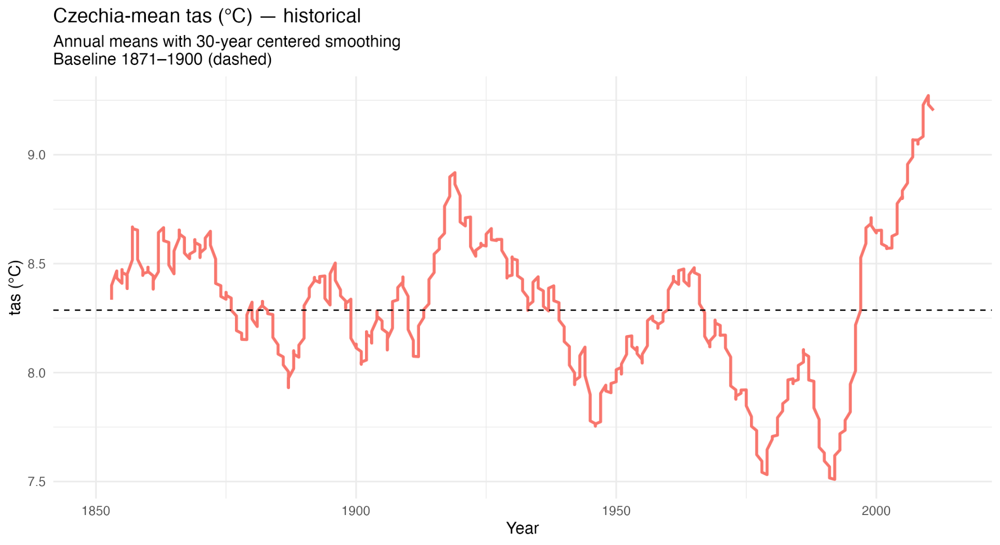{#fig-hist-temp}

The combined historical and projected temperature time series shows divergence between scenarios after 2015:

- **SSP1-2.6**: Temperature stabilizes around 9.5°C by mid-century
- **SSP3-7.0**: Continuous warming to approximately 11.7°C by 2100
- **SSP5-8.5**: Strongest warming, reaching ~12°C by end of century

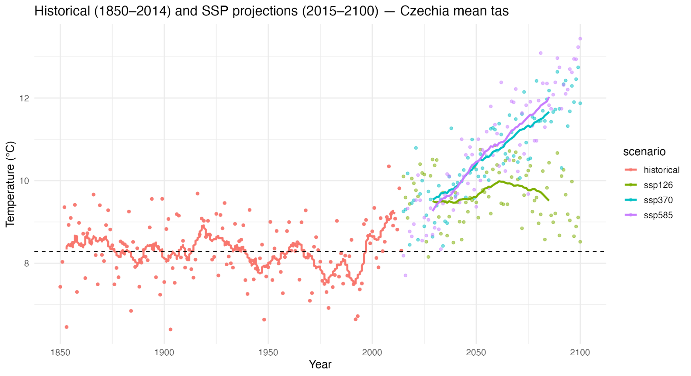{#fig-stitched-temp}

**Temperature anomalies (2071–2100 vs. 1871–1900 baseline)**:

| Scenario | End-of-century mean (°C) | Warming (ΔT) |
|----------|--------------------------|--------------|
| SSP1-2.6 | 9.52 | +1.23°C |
| SSP3-7.0 | 11.66 | +3.38°C |
| SSP5-8.5 | 12.03 | +3.74°C |

## Warming level scenarios of precipitation

To understand precipitation changes at specific global warming thresholds, we developed warming level scenarios following CMIP6 methodology. Daily temperature data was aggregated to annual means and smoothed using a 29-year running mean. The period 1850–1900 was established as the pre-industrial baseline for all anomaly calculations.

After concatenating historical data with each SSP scenario, temperature anomalies were computed relative to the baseline mean. The analysis identified the first year when Czechia is projected to exceed +1°C, +1.5°C, +2°C, +2.5°C, +3°C, +3.5°C, and +4°C of warming for each emission pathway. For each warming level, the corresponding 29-year mean precipitation was calculated.

```{r}
#| label: hw2-warming-levels
#| eval: false
#| code-fold: true
#| code-summary: "Assignment 2: Warming Level Precipitation Analysis Code"

library(terra)
library(data.table)
library(zoo)

# Parameters
SMOOTH_SPAN <- 29
BASELINE_YEARS <- 1850:1900
WARM_LEVELS <- seq(1.0, 4.0, by = 0.5)

# Process temperature: daily → annual → 29-yr smooth
tas_annual <- tas_daily[, .(tas_annual = mean(tas, na.rm = TRUE)), 
                        by = .(scenario, year)]

# Calculate baseline temperature
baseline_tas <- tas_annual[scenario == "historical" & year %in% BASELINE_YEARS, 
                           mean(tas_annual, na.rm = TRUE)]

# Concatenate historical with each SSP and apply smoothing
tas_combined[, tas_smooth := frollmean(tas_annual, n = SMOOTH_SPAN, align = "center"), 
             by = scenario]
tas_combined[, tas_anomaly := tas_smooth - baseline_tas]

# Find when each warming level is reached
find_warming_year <- function(dt, level) {
  hit <- dt[tas_anomaly >= level][1]
  if (nrow(hit) > 0) return(hit$year)
  return(NA_integer_)
}

# Calculate precipitation at each warming level (29-yr window)
calc_pr_at_warming <- function(wl_row, pr_data, baseline_pr) {
  yr_start <- wl_row$center_year - 14
  yr_end <- wl_row$center_year + 14
  
  pr_window <- pr_data[scenario == wl_row$scenario & 
                        year >= yr_start & year <= yr_end]
  pr_mean <- mean(pr_window$pr, na.rm = TRUE)
  
  data.table(
    scenario = wl_row$scenario,
    warming_level = wl_row$warming_level,
    center_year = wl_row$center_year,
    pr_at_wl = pr_mean,
    pr_change_pct = 100 * (pr_mean - baseline_pr) / baseline_pr
  )
}
```

The temperature trajectory analysis shows clear divergence between scenarios after 2000:

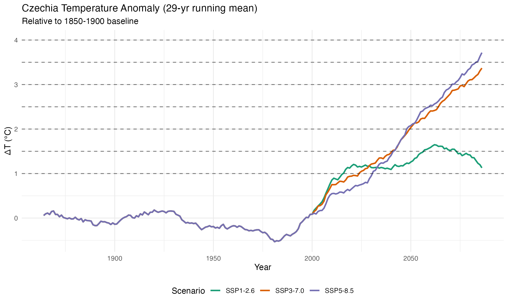{#fig-hw2-temp}

**Warming threshold timing and precipitation changes**:

| Scenario | Warming Level | Center Year | Precipitation (mm/yr) | Change (%) |
|----------|---------------|-------------|----------------------|------------|
| SSP1-2.6 | +1.0°C | 2016 | 828.5 | +0.9% |
| SSP1-2.6 | +1.5°C | 2057 | 867.4 | +5.6% |
| SSP3-7.0 | +1.0°C | 2024 | 861.5 | +4.9% |
| SSP3-7.0 | +1.5°C | 2041 | 862.9 | +5.1% |
| SSP3-7.0 | +2.0°C | 2050 | 860.5 | +4.8% |
| SSP3-7.0 | +2.5°C | 2064 | 849.5 | +3.4% |
| SSP3-7.0 | +3.0°C | 2078 | 858.1 | +4.5% |
| SSP5-8.5 | +1.0°C | 2031 | 895.6 | +9.0% |
| SSP5-8.5 | +1.5°C | 2042 | 916.5 | +11.6% |
| SSP5-8.5 | +2.0°C | 2048 | 904.8 | +10.2% |
| SSP5-8.5 | +2.5°C | 2060 | 823.9 | +0.3% |
| SSP5-8.5 | +3.0°C | 2071 | 771.4 | −6.1% |
| SSP5-8.5 | +3.5°C | 2084 | 817.1 | −0.5% |

The precipitation change at warming levels shows non-linear behavior, particularly under SSP5-8.5:

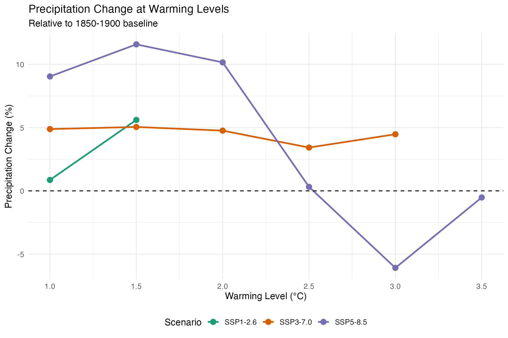{#fig-hw2-precip-warming}

The precipitation time series reveals substantial variability and a complex relationship with temperature:

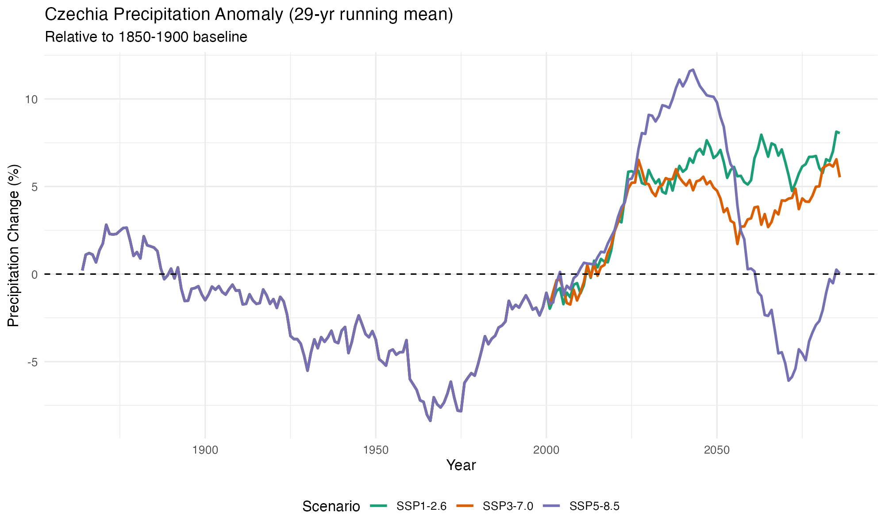{#fig-hw2-precip-time}

**Key findings from warming level analysis**:

- Under SSP1-2.6, warming stabilizes at ~1.5°C by mid-century with precipitation increasing by ~5.6%
- Under SSP3-7.0, warming reaches ~3.0°C by 2078 with precipitation remaining relatively stable (+3–5%)
- Under SSP5-8.5, precipitation peaks at +11.6% at 1.5°C warming (2042), then **decreases** at higher warming levels
- At +3.0°C warming under SSP5-8.5, precipitation actually decreases by 6.1% relative to baseline
- This non-linear response suggests a potential shift in precipitation regime at higher warming levels

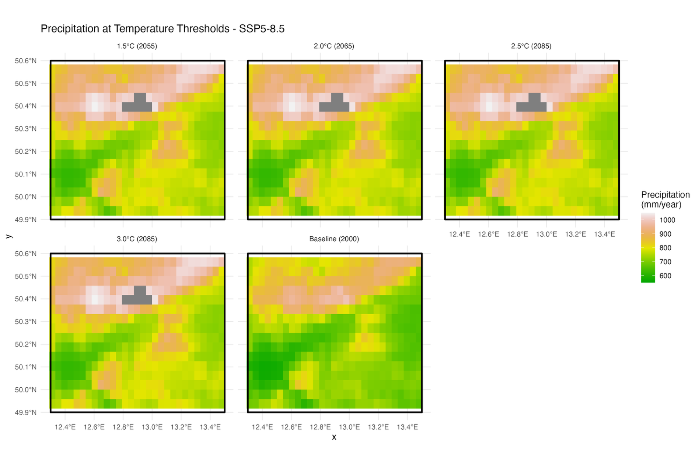{#fig-precip-thresholds}

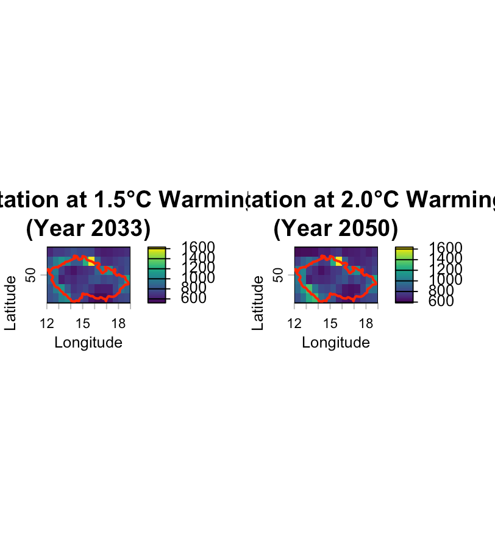{#fig-warming-levels}

The change in precipitation between the 2.0°C and 1.5°C warming levels reveals spatial heterogeneity across Czechia:

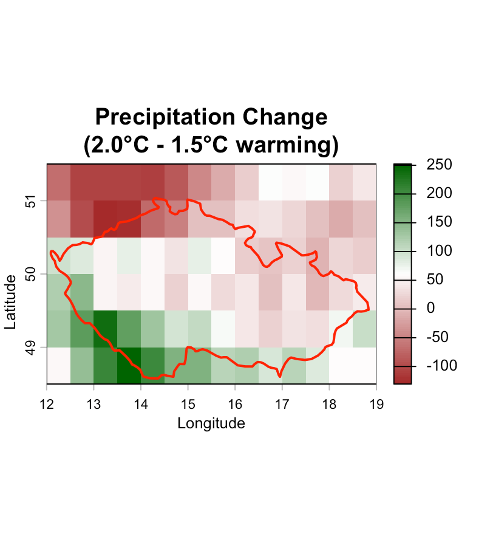{#fig-precip-change}

**Key findings**:

- All scenarios show increasing precipitation with higher warming levels
- Northern and mountainous regions show larger precipitation increases (+50 to +250 mm/year)
- Southern and central lowlands show smaller increases or slight decreases
- The spatial contrast intensifies with higher warming levels
- Precipitation changes are roughly proportional to warming magnitude across scenarios

# Downscaling to fine resolution

## Animation of changes in precipitation

We created spatial visualizations and animations showing precipitation evolution in the Ohře Basin from the baseline period through future projections.

```{r}
#| label: hw3-animation-code
#| eval: false
#| code-fold: true
#| code-summary: "Assignment 3: Animation and Visualization Code"

library(terra)
library(sf)
library(ggplot2)
library(gganimate)

# Load precipitation data
prec_baseline <- rast(list.files("data/climate/baseline", 
                                  pattern = "prec.*\\.tif$", full.names = TRUE))
prec_ssp126 <- rast("data/climate/ssp126/wc2.1_2.5m_prec_GFDL-ESM4_ssp126_2041-2060.tif")
prec_ssp370 <- rast("data/climate/ssp370/wc2.1_2.5m_prec_GFDL-ESM4_ssp370_2041-2060.tif")
prec_ssp585 <- rast("data/climate/ssp585/wc2.1_2.5m_prec_GFDL-ESM4_ssp585_2041-2060.tif")

# Load Ohře basin boundary
ohre_basin <- st_read("data/ohre_basin.shp")

# Crop and mask to basin
annual_baseline <- sum(crop(mask(prec_baseline, vect(ohre_basin)), vect(ohre_basin)))
annual_126 <- sum(crop(mask(prec_ssp126, vect(ohre_basin)), vect(ohre_basin)))
annual_370 <- sum(crop(mask(prec_ssp370, vect(ohre_basin)), vect(ohre_basin)))
annual_585 <- sum(crop(mask(prec_ssp585, vect(ohre_basin)), vect(ohre_basin)))

# Convert to data frames for ggplot
raster_to_df <- function(rast, scenario, year) {
  df <- as.data.frame(rast, xy = TRUE)
  df$scenario <- scenario
  df$year <- year
  names(df)[3] <- "precipitation"
  return(df)
}

# Create animated plot
p_animated <- ggplot() +
  geom_raster(data = time_series_df, aes(x = x, y = y, fill = precipitation)) +
  geom_sf(data = ohre_basin, fill = NA, color = "black", size = 1.5) +
  scale_fill_gradientn(colors = terrain.colors(100), name = "Precipitation\n(mm/year)") +
  facet_wrap(~scenario, ncol = 3) +
  transition_time(year) +
  labs(title = "Precipitation Evolution - Ohře Basin", subtitle = "Year: {frame_time}")

animate(p_animated, nframes = 50, fps = 5, width = 1000, height = 400,
        renderer = gifski_renderer("precipitation_evolution.gif"))
```

**Precipitation comparison across scenarios (Ohře Basin)**:

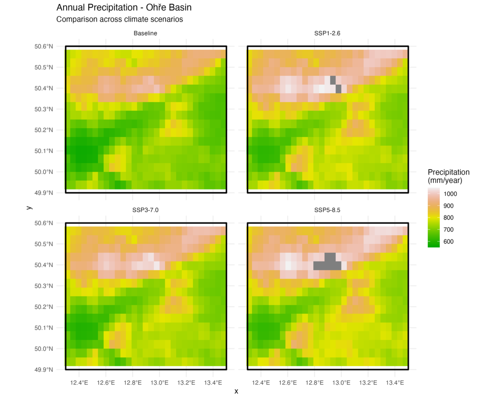{#fig-precip-comparison}

**Basin-averaged precipitation values**:

| Scenario | Annual Precipitation | Change from Baseline |
|----------|---------------------|---------------------|
| Baseline (1970–2000) | 751.7 mm | — |
| SSP1-2.6 (2041–2060) | 808.6 mm | +56.9 mm (+7.6%) |
| SSP3-7.0 (2041–2060) | 790.5 mm | +38.9 mm (+5.2%) |
| SSP5-8.5 (2041–2060) | 822.1 mm | +70.4 mm (+9.4%) |

The animated visualization shows the temporal evolution of precipitation patterns:

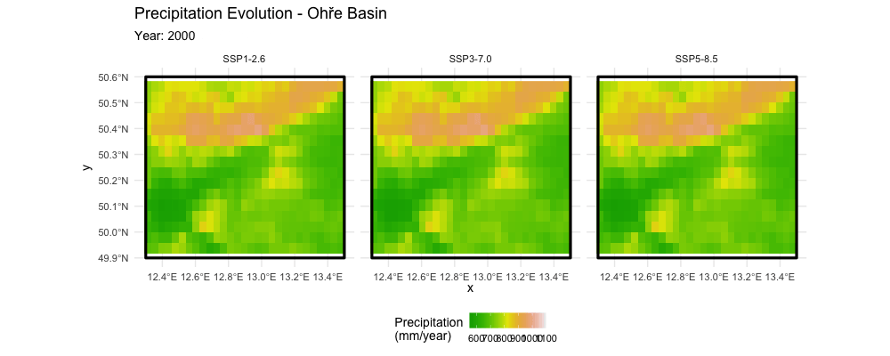{#fig-animation}

## Downscaling performance

We compared two spatial downscaling methods to increase the resolution of climate model output:

1. **Bilinear interpolation**: A simple weighted-average method
2. **Kriging**: A geostatistical method that accounts for spatial autocorrelation

```{r}
#| label: hw4-downscaling-code
#| eval: false
#| code-fold: true
#| code-summary: "Assignment 4: Downscaling Comparison Code"

library(terra)
library(gstat)
library(sp)

# Load precipitation data for warming threshold years
pr_15C <- pr_data[[which(2015:2100 == 2033)]]  # 1.5°C warming year
pr_20C <- pr_data[[which(2015:2100 == 2050)]]  # 2.0°C warming year

# Define target resolutions
# Step 1: 55.5 km → 27.8 km (half resolution)
# Step 2: 27.8 km → 13.9 km (quarter resolution)

# Bilinear interpolation
high_res_step1 <- rast(ext(pr_15C), resolution = res(pr_15C)/2, crs = crs(pr_15C))
pr_15C_bilinear_step1 <- resample(pr_15C, high_res_step1, method = "bilinear")

high_res_step2 <- rast(ext(pr_15C), resolution = res(pr_15C)/4, crs = crs(pr_15C))
pr_15C_bilinear_step2 <- resample(pr_15C, high_res_step2, method = "bilinear")

# Kriging
# Convert raster to spatial points
pts <- as.data.frame(pr_15C, xy = TRUE, na.rm = TRUE)
coordinates(pts) <- ~x+y
proj4string(pts) <- CRS("+proj=longlat +datum=WGS84")

# Fit variogram and perform kriging
v <- variogram(layer~1, pts)
v_fit <- fit.variogram(v, vgm("Sph"))
kriged <- krige(layer~1, pts, newdata = high_res_grid, model = v_fit)

# Calculate statistics
calc_stats <- function(raster_data, name) {
  vals <- values(raster_data, na.rm = TRUE)
  data.frame(
    Dataset = name,
    Min = round(min(vals), 2),
    Max = round(max(vals), 2),
    Mean = round(mean(vals), 2),
    SD = round(sd(vals), 2),
    N_cells = sum(!is.na(vals))
  )
}
```

**Downscaling results at 2.0°C warming (Year 2050)**:

{#fig-downscaling-maps}

**Statistical comparison of downscaling methods**:

| Resolution | Method | Mean (mm) | SD (mm) | Grid Cells |
|------------|--------|-----------|---------|------------|
| 55.5 km (original) | — | 829.36 | 190.80 | 84 |
| 27.8 km (Step 1) | Bilinear | 829.36 | 153.02 | 336 |
| 27.8 km (Step 1) | Kriging | 829.96 | 180.97 | 336 |
| 13.9 km (Step 2) | Bilinear | 829.36 | 146.40 | 1344 |
| 13.9 km (Step 2) | Kriging | 830.03 | 180.42 | 1344 |

**Difference maps (Kriging minus Bilinear)**:

{#fig-diff-maps}

**Key observations**:

- Both methods preserve the mean precipitation values (~829-830 mm)
- Kriging produces higher variability (SD ~180 mm vs ~146-153 mm for bilinear)
- Bilinear interpolation creates smoother fields
- Kriging better captures local extremes and spatial patterns
- Differences are largest in areas with high spatial gradients (mountain regions)

# Metacentrum implementation

## Infrastructure

The analysis was performed on Metacentrum, the Czech national grid computing infrastructure. We utilized:

- **Virtual machine**: Ubuntu-based VM with 4 CPU cores and 8 GB RAM
- **Storage**: Network-attached storage for data files (~2 GB total)
- **Software**: R 4.x with terra, sf, ncdf4, gstat, and visualization packages

The directory structure on the VM:

```
/home/ubuntu/
├── data/
│   ├── assignment2.R
│   ├── assignment3.R
│   ├── gfdl-esm4_*_historical_pr_cze_daily_2001_2010.nc
│   ├── gfdl-esm4_*_historical_tas_cze_daily_2001_2010.nc
│   ├── precipitation_plot.png
│   ├── precipitation_results.csv
│   ├── temperature_plot.png
│   └── temperature_results.csv
└── containers/
    ├── climate_analysis.def
    └── climate_analysis.sif (1.9 GB)
```

{#fig-meta-data}

## Cloud container

We created a Singularity container for reproducible analysis. The container definition file (`climate_analysis.def`) specifies:

- Base image: Ubuntu 22.04
- R installation with required packages
- Climate data processing tools (CDO, NCO)
- All dependencies for spatial analysis

The container (`climate_analysis.sif`, 1.9 GB) encapsulates the complete analysis environment, ensuring reproducibility across different computing systems.

{#fig-meta-container}

**Container execution**:
```bash
singularity exec climate_analysis.sif Rscript assignment3.R
```

**Output files generated on Metacentrum**:

The container successfully processed historical climate data (2001-2010) for Czechia:

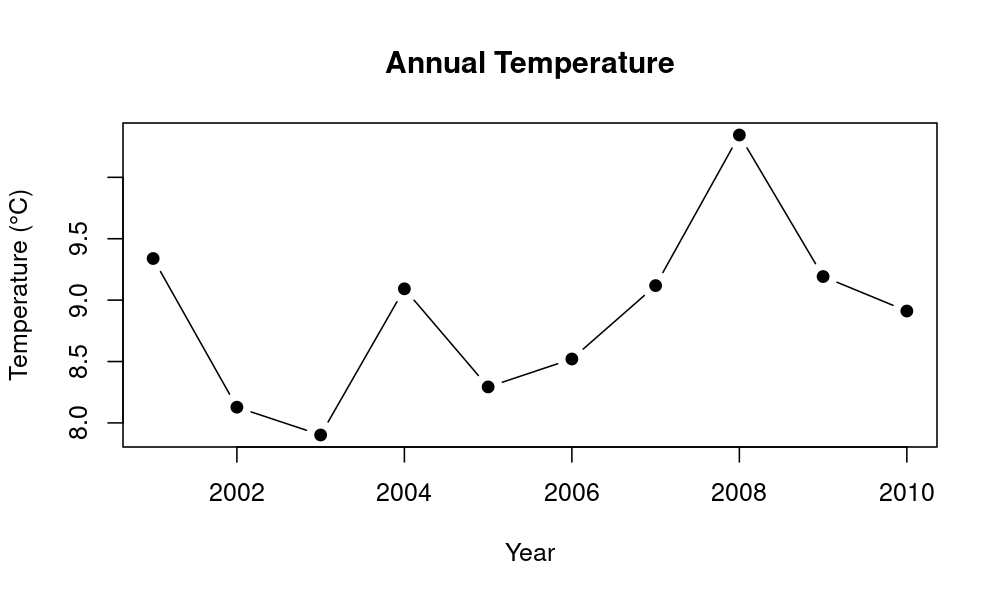{#fig-meta-temp}

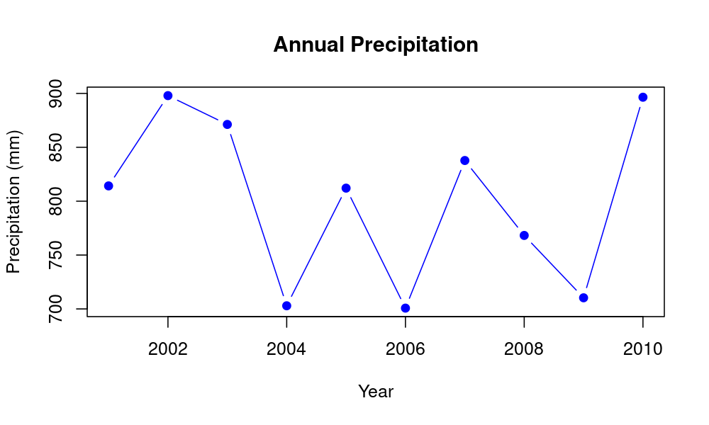{#fig-meta-precip}

# Discussion and Conclusions

## Summary of Results

This project analyzed climate projections for Czechia using GFDL-ESM4 model output under three SSP scenarios. The main findings are:

1. **Temperature**: Czechia is projected to warm by 1.2–3.7°C by 2100 depending on the emission scenario. The warming is already detectable in the historical record, with acceleration after 1980.

2. **Precipitation at warming levels**: Precipitation shows complex spatial patterns at different warming thresholds. Northern regions and mountains generally become wetter, while southern lowlands may experience drying.

3. **Scenario comparison**: SSP5-8.5 shows the most dramatic changes, while SSP1-2.6 limits warming to approximately 1.2°C—below the Paris Agreement 1.5°C target.

4. **Downscaling**: Both bilinear interpolation and kriging successfully increased spatial resolution from 55 km to 14 km. Kriging preserves more local variability but requires more computational resources.

## Limitations

Several limitations should be considered when interpreting these results:

1. **Single model**: We used only GFDL-ESM4; a multi-model ensemble would provide more robust uncertainty estimates
2. **Statistical downscaling**: Bilinear interpolation and kriging are statistical methods that do not add physical information; dynamical downscaling would better capture local processes
3. **No bias correction**: The raw model output was used without bias correction against observations
4. **Temporal limitations**: Precipitation analysis focused on specific time periods rather than full transient simulations
5. **Spatial aggregation**: Country-level temperature averages mask important regional variations

## Future Work

Future extensions of this analysis could include:

- Multi-model ensemble analysis for uncertainty quantification
- Bias correction using observational datasets (E-OBS, CRU)
- Dynamical downscaling with regional climate models
- Impact assessment for specific sectors (agriculture, water resources)
- Extreme event analysis (heat waves, droughts, heavy precipitation)

# Code and Container Documentation

## R Packages Used

```{r}
#| label: packages-list
#| eval: false

# Core packages
library(terra)        # Raster data handling
library(sf)           # Vector data (shapefiles)
library(ncdf4)        # NetCDF file I/O

# Spatial interpolation
library(gstat)        # Geostatistics and kriging
library(sp)           # Spatial data classes

# Data manipulation
library(tidyverse)    # Data wrangling (dplyr, tidyr, ggplot2)
library(lubridate)    # Date handling
library(zoo)          # Rolling means

# Visualization
library(viridis)      # Color scales
library(gganimate)    # Animations
library(gridExtra)    # Multiple plots
```

## Container Definition

The Singularity container was built using the following definition file:

```bash
# climate_analysis.def
Bootstrap: docker
From: ubuntu:22.04

%post
    apt-get update && apt-get install -y \
        r-base \
        r-base-dev \
        libnetcdf-dev \
        libgdal-dev \
        libproj-dev \
        libgeos-dev \
        libudunits2-dev
    
    R -e "install.packages(c('terra', 'sf', 'ncdf4', 'tidyverse', 
                             'gstat', 'zoo', 'viridis'), 
                           repos='https://cloud.r-project.org')"

%runscript
    Rscript "$@"
```

## Data Processing Workflow

The complete workflow consists of:

1. **Data acquisition**: Download CMIP6 data from ESGF/ISIMIP
2. **Preprocessing**: Extract variables, convert units, subset to study area
3. **Analysis**: Calculate statistics, identify thresholds, perform downscaling
4. **Visualization**: Generate plots, maps, and animations
5. **Documentation**: Compile results into reproducible report
